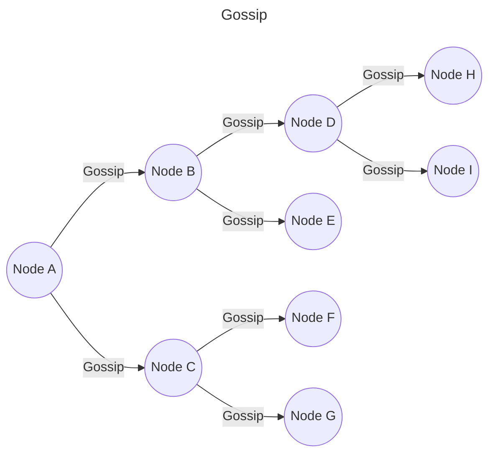
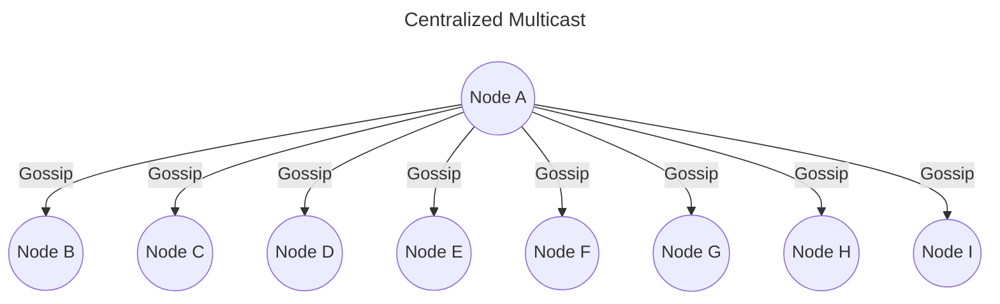

# Fofoka

> Fofoka stands for gossip in Portuguese, but with "k" in place of "c"

Gossip is a rumor that is spread by one person to others. Just like epidemics, a single infected person could later infect the entire world.

Gossip is a multicast protocol. It differs from centralized multicast protocols by eliminating the need to rely on one node to send a message. All nodes receive the message, but not all nodes need to send messages.

## How does it work?

Gossip protocol is used to share information to other nodes in a network. Periodically, one of the nodes is randomly selected to spread some information. The nodes that receive the message do the same thing.

Properties:

- Random selection;
- Turn based (each turn the process repeats);
- Each node has a partial view of the entire network state.

Observe the two images below and catch the differences between Gossip and centralized Multicast protocols:

